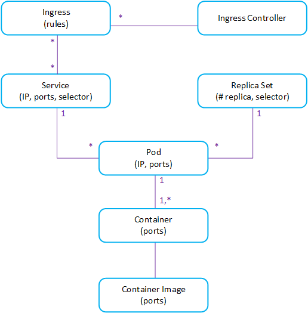

# Introduction to AKS

This is an introduction demo to AKS.  It goes through the main concepts of of Kubernetes and how AKS enables integration with Azure resources.

In your journey with AKS, you might want to consider looking at [my AKS repo](https://github.com/vplauzon/aks).  It's a collection of different deep dive into AKS topics.

## Demo Map:  Kubernetes' Anatomy

The demo basically follow the different concepts in this map:



By no mean is this Kubernetes' anatomy complete.  There are a lot of concepts we won't cover.  This map focuses on compute concepts, i.e. how to deploy containers and access them.

## Container images

We start our journey with container images.

For simplicity, we will not use [Azure Container Registry](https://vincentlauzon.com/2018/05/01/azure-container-registry-getting-started/), which would be a more realistic choice in an Enterprise Context.

Instead, we are going to use [Docker Hub](https://hub.docker.com/).

An image we are going to use a lot is [vplauzon/get-started:part2-no-redis](https://cloud.docker.com/u/vplauzon/repository/docker/vplauzon/get-started).  That name follows Docker's standard:

```
<account name> / <repository name> : <tag>
```

(Where *tag* is optional)

That image is as simple as it gets.  It is based on [Docker's get started tutorial](https://docs.docker.com/get-started/part2/) and code for it can be found [here](https://github.com/vplauzon/containers/tree/master/get-started-no-redis).

In order to play with Docker itself (something we won't do in this demo), the easiest way is to use our [Docker VM Image](https://vincentlauzon.com/2018/04/11/linux-custom-script-docker-sandbox/) which can be deployed from [GitHub here](https://github.com/vplauzon/containers/tree/master/DockerVM).

## Deploying AKS


## Single pod

Let's deploy our first pod.  We'll use 