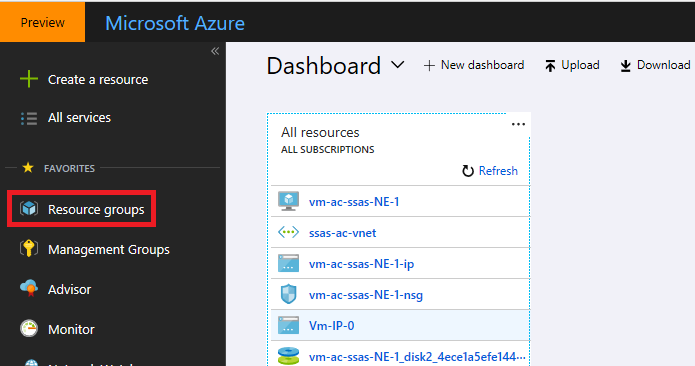
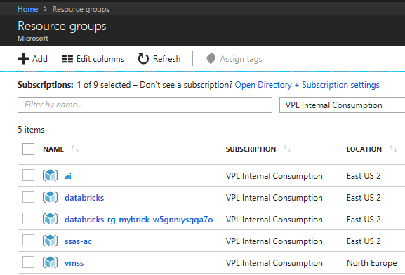
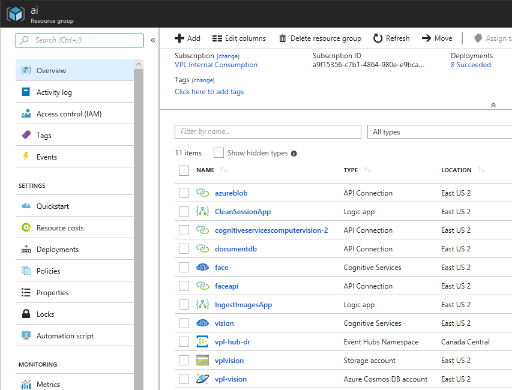

# Introduction to ARM Lab

This lab does an introduction to Azure Resource Model (ARM).

## Lab objectives

Get familiar with ARM using the Azure Portal, PowerShell, CLI & ARM Template.

## Install pre-requisites

1. Install Microsoft Azure PowerShell https://azure.microsoft.com/en-us/downloads/
2. Install Azure command-line interface (CLI) https://azure.microsoft.com/en-us/downloads/

## Portal Experience

1. Go to http://portal.azure.com
1. Select *Resource Group* on the left-hand side menu

1. We should see a list of resource groups assuming our subscription isn't empty

    * The middle column tells which subscription the resource group belongs to (this view allows us to look at multiple subscriptions at the same time)
    * The right column tells where, i.e. in which Azure region, the resource group lives
1.  Let's select the first resource group (in our example, *ai*)
1.  We should see a list of resources, assumign the resource group isn't empty

    * The middle column gives us the *type* of resources
    * The right column gives the location, i.e. Azure region, where the resource is deployed
1. From there we can go within a resource

## CLI Experience

The CLI is a cross platform tool that can be installed on Windows, Linux & MacOS.  Here we are using it within [Bash on Windows leveraging Windows Subsystem for Linux](https://docs.microsoft.com/en-us/windows/wsl/install-win10).

It can also be accessed through the Bash Cloud Shell or https://shell.azure.com/.

1. Let's first login to the CLI with our Azure AD credentials
    * Let's type `az login`
    * The command line should invite us to go to https://microsoft.com/devicelogin
    * The web page will ask us for a code ; the code is given to us in the command line window
    * We can then continue and login as we typically do in Azure AD
    * The command line should unlock and show that we are authenticated
1. Let's type `az group list`
1. This should return the list of resource groups in our subscription in JSON format
1. Let's type `az group list -o jsonc`
1. This gives us a coloured JSON output
1. Let's type `az group list -o table`
1. This gives us a tabular output similar to what we got in the portal
1. We can list the resources in the resource group *ai* by typing
`az resource list -g ai -o table`
1. The JSON output can be queried using the [JMESPath standard](http://jmespath.org/)
Let's project the output and keep only three properties:
`az resource list -g ai --query "[*].{location:location, name:name, type:type}"`
1. This gives us an uncluttered JSON output

## PowerShell Experience

It can also be accessed through the PowerShell Cloud Shell or https://shell.azure.com/.

1. Let's first login to PowerShell with our Azure AD credentials
    * Let's type `Add-AzureRmAccount`
    * A login window should pop up
    * We can login as we typically do in Azure AD
1. Let's type `Get-AzureRmResourceGroup`
1. This should return the list of resource groups
1. As with any PowerShell commandlets, the output is .NET objects.  We can therefore do what we can do with any PowerShell commandlets, such as projecting:
`Get-AzureRmResourceGroup | select ResourceGroupName`
1. We can list the resources in the resource group *ai* by typing
`Get-AzureRmResource | where {$_.ResourceGroupName -eq "ai"}`
1. We can project only important information
`Get-AzureRmResource | where {$_.ResourceGroupName -eq "ai"} | select Name, ResourceType`