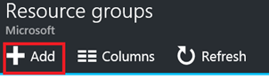
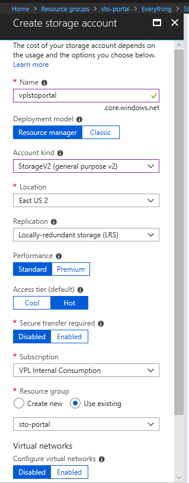
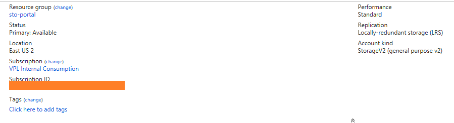

# Introduction to Automation

This lab does an introduction to Azure Automation.

## Lab objectives

Create a storage account in three ways:  portal, PowerShell, ARM template.

## Prerequisites

We recommend going through our [ARM Introduction](https://github.com/vplauzon/azure-training/tree/master/arm-intro) lab.

## Portal Experience

1. Go to http://portal.azure.com
1. First, let's create a resource group:
    * Select *Resource Group* on the left-hand side menu
    * Select Add
    
    * Fill the fields:  *sto-portal* for the name & *East US 2* for the location
    * Press Create
1. We should see the created resource group ; otherwise we can hit the *refresh* button
1. Let's select the *sto-portal* resource group
1. Select *Add* to add a resource
1. This brings us to an Azure Marketplace search box
1. Type *blob storage*
1. Select the offering *Storage account - blob, file, table, queue* published by *Microsoft*
1. Press *Create*
    * In *Name*, type a unique DNS label, e.g. *vplstoportal*
    * In *Account Kind*, select *Storage V2 (general purpose v2)*
    * Under Resource Group, select *Use Existing* and select *sto-portal*
    * Hit Create
    
1. This shouldn't take more than a few seconds to create
1. Let's go back to our resource group
1. Let's select the storage account resource
1. We can see the configuration is as what we specified

## CLI Experience

1. Let's type
`az group create --name sto-cli --location eastus2`