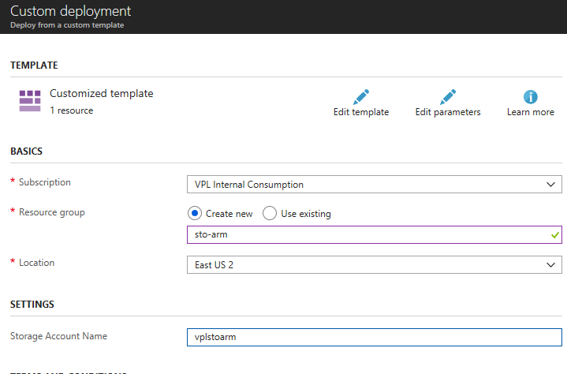

# Introduction to Automation

This lab does an introduction to Azure Automation.

## Lab objectives

Create a storage account in three ways:  portal, PowerShell, ARM template.

## Prerequisites

We recommend going through our [ARM Introduction](https://github.com/vplauzon/azure-training/tree/master/arm-intro) lab.

## Portal Experience

1. Go to http://portal.azure.com
1. First, let's create a resource group:
    * Select *Resource Group* on the left-hand side menu
    * Select Add
    
    * Fill the fields:  *sto-portal* for the name & *East US 2* for the location
    * Press Create
1. We should see the created resource group ; otherwise we can hit the *refresh* button
1. Let's select the *sto-portal* resource group
1. Select *Add* to add a resource
1. This brings us to an Azure Marketplace search box
1. Type *blob storage*
1. Select the offering *Storage account - blob, file, table, queue* published by *Microsoft*
1. Press *Create*
    * In *Name*, type a unique DNS label, e.g. *vplstoportal*
    * In *Account Kind*, select *Storage V2 (general purpose v2)*
    * Under Resource Group, select *Use Existing* and select *sto-portal*
    * Hit Create
    
1. This shouldn't take more than a few seconds to create
1. Let's go back to our resource group
1. Let's select the storage account resource
1. We can see the configuration is as what we specified

## CLI Experience

1. Let's create a resource group:
`az group create --name sto-cli --location eastus2`
1. Let's create a storage in that resource group:
`az storage account create --name vplstocli --resource-group sto-cli --location eastus2 --kind StorageV2 --sku Standard_LRS`
1. We can valide through the portal that the configuration is the same as the storage account we created

## ARM Template

1. We do not need to create a new resource group ; we'll do that in the deployment process
1. Let's deploy the ARM template [defined here](https://github.com/vplauzon/azure-training/blob/master/automation-intro/storage-arm-template.json):

1. This should pop up the Azure portal with an Azure Template form
1. Let's fill the form:
    * In *Resource Group*, select *Create new* and type *sto-arm*
    * In *Location*, select *East US 2*
    * In *Storage Account Name*, type a unique name, e.g. *vplstoarm*
    
1. Select the tick box *I agree to the terms and conditions stated above* after reading it
1. Click *Purchase*
1. Again, we can valide through the portal that the configuration is the same as the other storage accounts we've created

This section showed how to deploy an ARM template from the portal.  We could also have deployed the ARM template using CLI (with `az group deployment create`) or PowerShell (with `New-AzureRmResourceGroupDeployment`).

## Clean Up (CLI)

Let's clean up the resource groups we have created.  Technically, there are no cost involved with the storage accounts we have created as long as there is no storage used.

The following commands bypass the "Are you sure you want to perform this operation?".  Be careful you do not do this with resource groups containing valuable resources.

1.  Type
`az group delete --name sto-arm --no-wait -y`
`az group delete --name sto-cli --no-wait -y`
`az group delete --name sto-portal --no-wait -y`

The commands do not prompt and return before the resource groups are deleted.  It deletes the resources under the resource group (i.e. storage accounts) before deleting the resource group.  The deletion should take about a minute.