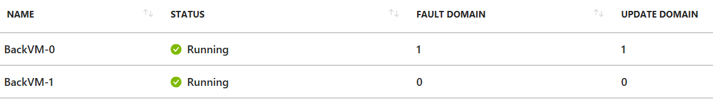

# Load Balancer Lab

This is the *Load Balancer* lab.

## Lab objectives

Configure a two tiers deployment with a front-end load balancer exposed as an public IP and a back-end load balancer exposed as a private IP.  We’ll use load balancing rules to balance traffic and NAT rules to forward different public IP ports to different VMs.

## ARM Template

This lab contains one ARM template that can be deployed (less than 4 minutes):

and visualized:

Here are the template parameters:

|Parameter|Mandatory|Description|
|--|--|--|
|Public Domain Label|Yes|domain prefix for the public IP ; must be unique within the deployment region ; typically alpha-numeric + hyphens.|
|VM Admin User Name|No|Name of the admin user on the created Linux VM ; default to *myadmin*|
|VM Admin Password|Yes|Password of the admin user on the created Linux VM ; must be complex|
|VM Size|No|Size fo the VMs|
|Fault Domain Count|No|# of fault domain in the availability set ; default to *3*.  Some national regions support only *2* fault domains.|
|Front Instance Count|No|# of VMs in the front tier ; default to *2*|
|Back Instance Count|No|# of VMs in the back tier ; default to *2*|

## Looking at deployment

Let’s look at the deployment once it is deployed (or while it is deploying).

1.	In the portal, go to *Resource Groups*
1. Select the resource group where we deployed the template
1. There should be 20 items in the resource group
1. We can sort them by *Type*
1. Let's select *backAvailSet*
    1. From the overview tab we should see the VMs within the availability set
    
    1. We can also notice they are distributed along different fault & update domains
    1. We can also notice the availability set is *managed*, which means the VM disks are aligned with fault domains
    1. We can close this pane to go back to the resource group
1. We can open the first disk we see (likely *BackVM-0*)
    1. In the overview tab we can see a lot of information
    
    1. We can see the disk state is *attached*, which means a VM currently is attached to the disk.
    1. We notice that Premium (SSD) storage was used for the disk
    1. We can see the size of the disk
    1.  We can see the OS is Linux
    1. We can close and go back to resource group
1. Let's open *PublicLB*, the public load balancer
    1. We can go through the different tabs to see the configuration
    2. Basically the load balancer is exposed through a public IP, has one back-end pool with the two front-end VMs in it, has a TCP health probe, has one load-balancing rule (HTTP, port 80) and two NAT rules forwarding traffic from port 22+ to the VMs' port 22.

## Exercises

Try connecting to the public IP using SSH.  This should get you to the first front end VM.  If you SSH using the port 23, it should get you to the second VM.

Try implementing IP filtering so that only your PC can SSH through.  Tip:  search for "what is my IP" in the browser search to know your exit-IP, then edit the *frontNsg* to enforce IP filtering.

## Clean up

We won’t be using the resource group we have created so we can delete the resource group.

We can either use PowerShell (command *Remove-AzureRmResourceGroup*) or via the Portal.
