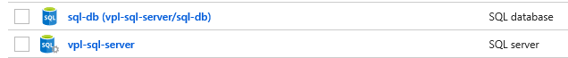
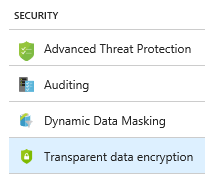
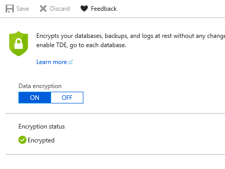
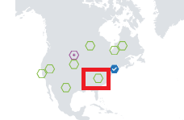
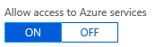
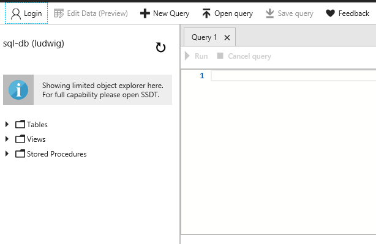

# PaaS Tour

This lab does a tour of a few *Platform as a Service* (PaaS).

## Lab objectives

Getting familiar with the concept of PaaS, the different shape they can take and how they connect to the rest of Azure.

## Prerequisites

We recommend going through our [ARM Introduction](https://github.com/vplauzon/azure-training/tree/master/arm-intro) lab.

## Deployment

In order to save time and because the focus isn't about creating the PaaS resources within the portal, let's deploy the PaaS resources we are going to use:

We suggest to deploy the content in a resource group named *paas-tour* located in region *East US 2*.

The parameter **Prefix** is used to make some resource name unique.  We recommend using the initial of your name & some number, e.g. *vpl42*.

## Azure SQL DB

Let's first look at the 2 resources related to Azure SQL DB.

Let's first open the *SQL Server* resource.

As opposed to its on-premise counterpart, the Azure SQL Server is a *logical* server. It acts as a container for databases.  It holds configuration common to the databases, e.g. collation, location & server admin.  It doesn't hold the compute nor does it accrues charges.

1. The server resource holds the firewall rules ; let's look at them

1. By default, we can see there are no firewall rules and no virtual network integration
We will come back to that screen.

Let's open the SQL Database resource.

1. The database is a compute resource:  it has a pricing tier & an endpoint

1. Let's look at data encryption

By default *Transparent Data Encryption* is activated

It is an opt-out option.  It is set at the database level.
1. Let's look at geo-replication

1. We can set replica in any regions ; let's select East-US

1. This leads us to the following form:

1. It is interesting to look at the form to understand the mechanisms of geo replication
   * We can control on which *SQL Server* the replica will land
      * Since a *SQL Server* is bound to a region, a replica must necessarily go to another server
   * The replica can be of a different pricing tier than the primary.  This can be interesting if the replica is used primarily for DR.  In that case we might want to drop the compute capacity in order to control cost.
1.  Let's connect to the database.  We could do that with any SQL Server tool, since Azure SQL DB behaves like any SQL Database.  For simplicity let's take the tool available in the portal:

1. Let's login:

1. The password for the server is defined as a variable in the [ARM template](https://github.com/vplauzon/azure-training/blob/master/paas-tour/paas-tour-arm-template.json) as "*SQL Password*"

1. This leads to the following error:

Basically, the Portal's services can't access the database.  SQL is locked down by default at the network level.
1. Let's open the server's firewall to Azure Services.  Let's start by openning going back to the *SQL Server* resource.  Let's go to the *Firewalls and virtual networks* option again.

1. Let's enable Azure Services:

1. Let's hit save
   * It is interesting to note that by doing this we gave access to any services in Azure, not only the portal.
   * It is possible to enable only some IP range
   * It is also possible to enable access from a Virtual Networks
1. Let's go back to the *SQL Database* resource and the query editor
1. Let's login again
1. We should now be successful

1. The ARM template that created the database copied the Adventure Work Light demo database.  We can see that by exploding the tables branch in the left-hand side tree view.

1. We can type the following query `SELECT * FROM SalesLT.Customer` and press run:

If we chose to login and perform queries from a client tool, e.g. Visual Studio, the scenario would have unfolded similarly.  Instead of enabling Azure Services in the Firewall though, we would have enabled our outbound client IP.

## Azure Cosmos DB

## Azure Functions

## Logic Apps

## Databricks

## Clean Up (CLI)

Let's clean up the resource group we have created.

The following commands bypass the "Are you sure you want to perform this operation?".  Be careful you do not do this with resource groups containing valuable resources.

Type:  `az group delete --name paas-tour --no-wait -y`

(If you used a different resource group name than *paas-tour*, change that in the command)

The commands do not prompt and return before the resource groups are deleted.  It deletes the resources under the resource group before deleting the resource group.  The deletion should take a few minutes.