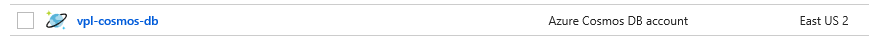
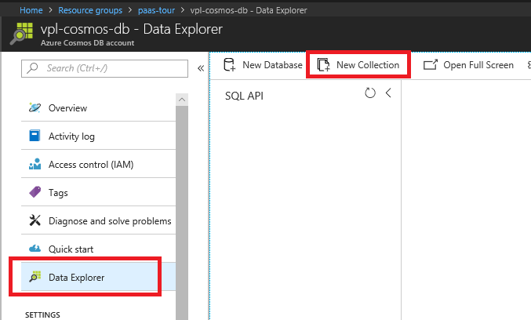
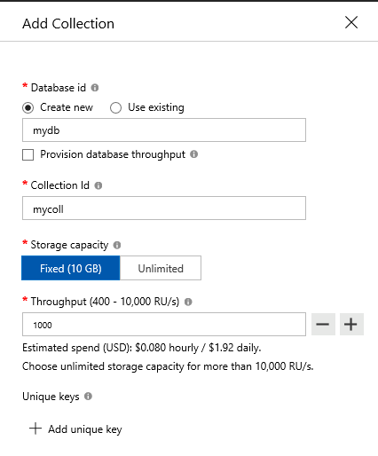
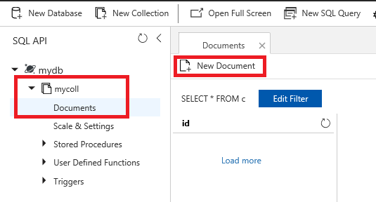
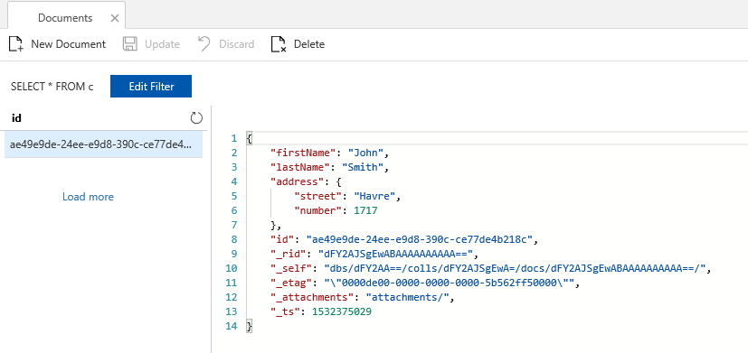
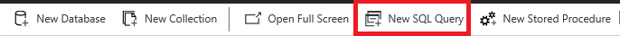
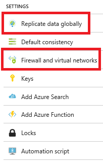

# Azure Cosmos DB

Cosmos DB deploys a single resource, an *Azure Cosmos DB account*.



Although Cosmos DB supports multiple model, e.g. SQL, Mongo DB, Table API, Gremlin (Graph) API & Cassandra API, we deployed a SQL API account.  This is a document-oriented database managing JSON document collections.

Let's explore it.

1. Let's select *Data Explorer* on the left hand side menu
1. Let's click *New Collection*

1. Let's fill the form fields as follow:
   * Database id:  *mydb*
   * Collection id:  *mycoll*
   * Let's leave everything else as is
   
1. Click *OK*
1. Let's open the *mycoll* collection tree view
1. Let's select document
1. Let's click on *New Document*

1. Let's input the following JSON document:
    ```
    {
      "firstName" : "John",
      "lastName" : "Smith",
      "address" : {
        "street" : "Havre",
        "number" : 1717,
        "city" : "Montreal"
      }
    }
    ```
1. Hit *Save*
1. We notice that more properties were added to our document, such as *id*, *_rid*, etc.

1. Let's do that again with
    ```
    {
      "firstName" : "Clara",
      "lastName" : "Oswald",
      "address" : {
        "street" : "Narrow",
        "number": 567,
        "city" : "London"
      }
    }
    ```
1. And finally
    ```
    {
      "firstName" : "Martha",
      "lastName" : "Jones",
      "address" : {
        "street" : "Clearfield",
        "number": 3256,
        "city" : "London",
        "country" : "England"
      }
    }
    ```
    * Notice that this document has an *address.country* property the other two documents do not
    * This is perfectly legal as Cosmos DB is schemaless and fully indexed by default
1. Let's do some queries on those documents

   1. Let's start with a simple `SELECT * FROM c`
      * This returns all the documents as a JSON array
   1. We can do a projection:
      ```
      SELECT
      c.firstName,
      c.lastName,
      c.address.street
      FROM c
      ```
   1. We can filter:
      ```
      SELECT
      c.firstName,
      c.lastName
      FROM c
      WHERE c.address.city='London'
      ```
   1. We can even filter on properties not present in each document:
      ```
      SELECT
      c.firstName,
      c.lastName
      FROM c
      WHERE c.address.country='England'
      ```
1. Similarly to Azure SQL DB, Cosmos DB also supports geo replication and virtual networks integration


